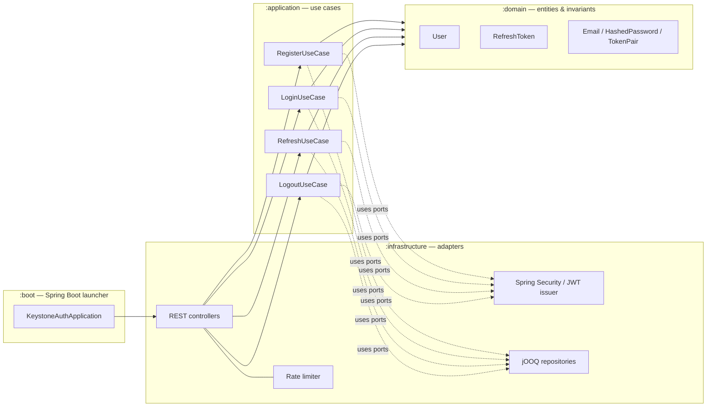
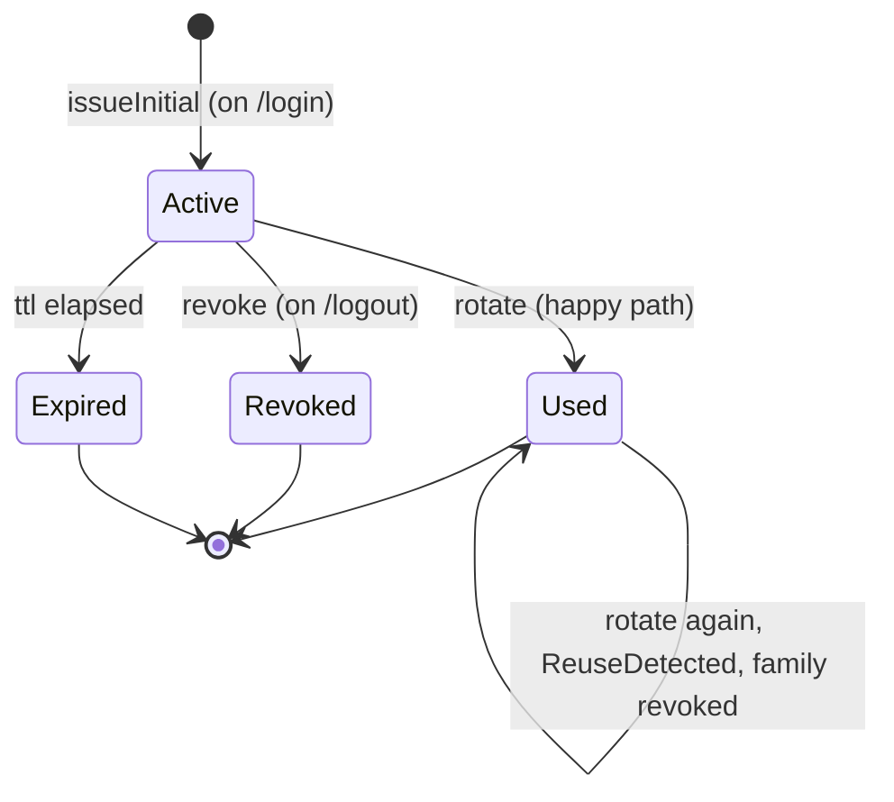

# keystone-auth

[](https://github.com/isnow-git/keystone-auth/actions/workflows/ci.yml)
[](LICENSE)
[](https://openjdk.org/projects/jdk/21/)
[](https://spring.io/projects/spring-boot)
[](https://www.postgresql.org/)
[](docs/adr/ADR-0003-hexagonal-architecture.md)
[](docs/adr/ADR-0001-rs256-over-hs256.md)

Standalone authentication microservice. Issues short-lived RS256 JWT access
tokens and rotation-protected refresh tokens; publishes its verification key
at `/.well-known/jwks.json` so any number of resource servers can verify
tokens locally without calling back.

The design choices behind every layer are recorded as ADRs in
[`docs/adr/`](docs/adr) — start there if you want the *why* before the *what*.

## Architecture

Hexagonal (ports & adapters). The dependency direction is enforced by the
Gradle multi-module layout: `:domain` declares no Spring on its classpath, so
a wrong import fails the build.



`:application` declares **ports** (interfaces) for everything it needs from
the outside world (`UserRepository`, `PasswordHasher`, `TokenIssuer`,
`RefreshTokenRepository`). `:infrastructure` provides the **adapters**.

## Tech stack

| Layer        | Choice                                         | Why                                                                                              |
|--------------|------------------------------------------------|--------------------------------------------------------------------------------------------------|
| Language     | Java 21 (virtual threads on)                   | Loom makes a blocking-per-request style cheap; no reactive complexity needed.                    |
| Framework    | Spring Boot 3.4                                | Production defaults, OAuth2 Resource Server, Actuator, mature ecosystem.                         |
| HTTP         | Spring MVC                                     | Synchronous handlers + virtual threads = simple code, high throughput.                           |
| Security     | Spring Security 6 + Nimbus JOSE                | OAuth2 Resource Server validates RS256 out of the box; Nimbus issues.                            |
| Password     | Argon2id (`spring-security-crypto`)            | Memory-hard. See [ADR-0002](docs/adr/ADR-0002-argon2id-over-bcrypt.md).                          |
| JWT signing  | RS256 (asymmetric)                             | Resource servers verify with public key. See [ADR-0001](docs/adr/ADR-0001-rs256-over-hs256.md).  |
| Persistence  | jOOQ + PostgreSQL                              | Type-safe SQL, no ORM leakage into the domain. See [ADR-0004](docs/adr/ADR-0004-jooq-over-jpa.md). |
| Migrations   | Flyway                                         | Versioned, repeatable, integrates with Spring Boot.                                              |
| Rate limit   | Bucket4j (in-memory token bucket)              | No external dependency for a single-instance deployment.                                         |
| Logging      | Logback + `logstash-logback-encoder` (JSON)    | One structured event per log line, ready for any log pipeline.                                   |
| Tests        | JUnit 5 + AssertJ + Testcontainers             | Real PostgreSQL for integration; pure JUnit for the domain.                                      |
| Build        | Gradle (Kotlin DSL) + Spotless + JaCoCo        | Type-safe build scripts; format and coverage enforced in CI.                                     |
| CI           | GitHub Actions → GHCR                          | Same provider as the repo; image lives next to the code.                                         |

## Run it

```bash
# 1. Generate an RS256 keypair (one-time)
mkdir -p keys
openssl genpkey -algorithm RSA -out keys/private.pem -pkeyopt rsa_keygen_bits:2048
openssl rsa -pubout -in keys/private.pem -out keys/public.pem

# 2. Start PostgreSQL + the app
docker compose up --build
```

The service comes up at `http://localhost:8080`. Actuator health at
`/actuator/health`.

## API

| Method | Path                              | Purpose                                                                  |
|--------|-----------------------------------|--------------------------------------------------------------------------|
| POST   | `/auth/register`                  | Create a new user. Body `{email, password}`. Returns 201.                |
| POST   | `/auth/login`                     | Exchange credentials for an access token + refresh cookie.               |
| POST   | `/auth/refresh`                   | Rotate the refresh token (cookie). Returns a new access token.           |
| POST   | `/auth/logout`                    | Revoke the active refresh-token family.                                  |
| GET    | `/auth/.well-known/jwks.json`     | RS256 public key set for resource servers.                               |
| GET    | `/actuator/health`                | Liveness/readiness probes.                                               |

Errors follow [RFC 7807 Problem Details](https://www.rfc-editor.org/rfc/rfc7807).
No stack traces or internal messages leak to the client.

## Security design

The token flow:

```mermaid
sequenceDiagram
    participant C as Client
    participant K as keystone-auth
    participant R as Resource server

    C->>K: POST /auth/login (email, password)
    Note right of K: issue access token (15m) +<br/>refresh cookie (HttpOnly, 7d)
    K-->>C: 200 + access token + Set-Cookie
    C->>R: GET /api with Authorization Bearer access
    Note right of R: verify with cached JWKS<br/>(no call to keystone)
    R-->>C: 200

    Note over C,K: Access token expires
    C->>K: POST /auth/refresh (cookie)
    Note right of K: hash + lookup; mark used;<br/>issue new (reuse revokes family)
    K-->>C: 200 + new access + rotated cookie
```

The refresh-token rotation state machine:



Highlights — full reasoning in the ADRs:

- **RS256 + JWKS.** Resource servers verify locally. The signing key never
  leaves `keystone-auth`. ([ADR-0001](docs/adr/ADR-0001-rs256-over-hs256.md))
- **Argon2id.** Memory-hard password hashing.
  ([ADR-0002](docs/adr/ADR-0002-argon2id-over-bcrypt.md))
- **Hexagonal architecture.** Auth rules isolated in a framework-free module.
  ([ADR-0003](docs/adr/ADR-0003-hexagonal-architecture.md))
- **jOOQ over JPA.** Type-safe SQL, no ORM annotations leaking into the
  domain. ([ADR-0004](docs/adr/ADR-0004-jooq-over-jpa.md))
- **Refresh token rotation + reuse detection.** Every refresh rotates;
  reusing a used token revokes the entire family.
  ([ADR-0005](docs/adr/ADR-0005-refresh-token-rotation.md))
- **Hashed at rest.** Refresh tokens are stored as SHA-256 hashes. Passwords
  as Argon2id encodings.
- **HttpOnly + Secure + SameSite=Strict** on the refresh cookie. The access
  token is never in a cookie.
- **No PII in the JWT payload.** Only `sub` (user id), `roles`, `jti`, `iat`,
  `exp`, `iss`.
- **Rate limited.** `/auth/login` and `/auth/register` per remote address.
- **Global exception handler.** Internal errors become RFC 7807 responses;
  stack traces never leave the process.

## Testing

- **Domain & application** — pure JUnit 5 + AssertJ. No Spring context.
  Sub-second feedback. ≥ 80% line / ≥ 70% branch coverage enforced by
  JaCoCo.
- **Infrastructure (persistence)** — `@SpringBootTest` with PostgreSQL via
  Testcontainers + `@ServiceConnection`. Real SQL against real Postgres.
- **REST** — `MockMvc` + `@WithMockUser` where appropriate; Testcontainers
  for end-to-end flows.

```bash
./gradlew test                       # all unit + integration tests
./gradlew :domain:test               # just the fast lane
./gradlew jacocoTestReport           # HTML report under build/reports/jacoco
./gradlew spotlessApply              # auto-format
```

## Architecture decisions

| ADR                                                                | Topic                                          |
|--------------------------------------------------------------------|------------------------------------------------|
| [ADR-0001](docs/adr/ADR-0001-rs256-over-hs256.md)                  | RS256 over HS256                               |
| [ADR-0002](docs/adr/ADR-0002-argon2id-over-bcrypt.md)              | Argon2id over BCrypt                           |
| [ADR-0003](docs/adr/ADR-0003-hexagonal-architecture.md)            | Hexagonal architecture                         |
| [ADR-0004](docs/adr/ADR-0004-jooq-over-jpa.md)                     | jOOQ over Spring Data JPA                      |
| [ADR-0005](docs/adr/ADR-0005-refresh-token-rotation.md)            | Refresh-token rotation + reuse detection       |

## Project layout

```
keystone-auth/
├── domain/             — pure Java, framework-free
├── application/        — use cases + ports
├── infrastructure/     — adapters (REST, jOOQ, Spring Security, JWT, rate limit)
├── boot/               — Spring Boot launcher
├── docs/adr/           — Architecture Decision Records
├── .github/workflows/  — CI pipeline
├── Dockerfile
└── docker-compose.yml
```

## License

[MIT](LICENSE)
